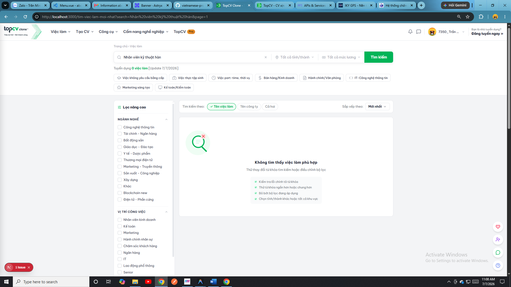

# 🚀 TÀI LIỆU TỔNG QUAN DỰ ÁN TOPCV-CLONE

Tài liệu này tóm tắt toàn bộ kiến trúc, công nghệ (Techstack), các tính năng chính, danh sách route của Frontend và danh sách các endpoint API của Backend thuộc hệ thống **TopCV-clone**.

---

## 1. 🛠️ CÔNG NGHỆ SỬ DỤNG (TECHSTACK)

### 💻 Frontend (Ứng dụng Client)
* **Framework chính**: `Next.js 16.2.6` (sử dụng App Router) kết hợp `React 19.2.4` và `TypeScript`.
* **Giao diện & Styling**: `Tailwind CSS v4` + `Class Variance Authority (CVA)` + `Radix UI` + `lucide-react` (icon).
* **Quản lý State & Trạng thái**: `Zustand` (Global State) + `@tanstack/react-query` (Server State / Caching).
* **Xử lý Tương tác & Kéo thả**: `@dnd-kit/core`, `@dnd-kit/sortable` (dành cho builder thiết kế CV).
* **Giao tiếp API**: `Axios` hỗ trợ interceptors tự động đính kèm và làm mới JWT Token.
* **Thời gian thực & Khác**: `Firebase` (Push Notification), `lottie-react` (hiệu ứng chuyển động), `recharts` (vẽ biểu đồ báo cáo doanh thu & tuyển dụng).

### ⚙️ Backend (Hệ thống Server)
* **Framework chính**: `NestJS 11` (Node.js framework phía Server).
* **Cơ sở dữ liệu & ORM**: `Prisma ORM 7.8` kết nối tới PostgreSQL (qua Neon Serverless Database Adapter `@prisma/adapter-neon`).
* **Bảo mật & Xác thực**: `Passport.js` tích hợp chiến lược `JWT` + `Social OAuth` (Google, Facebook, LinkedIn), hỗ trợ xác thực 2 lớp **2FA** (OTP mã xác thực gửi qua Email).
* **Đa phương tiện**: `Cloudinary` (quản lý upload hình ảnh, avatar, logo công ty) + `Multer` (xử lý file multipart).
* **Thời gian thực (Realtime)**: `@nestjs/websockets` + `ws` (WebSockets cho Chat trực tiếp).
* **Tích hợp Trí tuệ Nhân tạo (AI)**:
  * `@google/genai` (kết nối Gemini API).
  * `groq-sdk` (gọi mô hình mã nguồn mở tốc độ cao như Llama).
  * `openai` (tích hợp OpenAI API).
  * Tác vụ: Đọc CV (PDF/Word bằng `pdf-parse`, `mammoth`), chấm điểm tương thích với mô tả công việc (ATS Matching).
* **Thanh toán**: Tích hợp các cổng thanh toán phổ biến tại Việt Nam gồm **MoMo**, **ZaloPay**, và **VNPay**.
* **Tác vụ nền & Khác**: `@nestjs/schedule` (Cron jobs gửi mail, tính toán), `@nestjs-modules/mailer` (gửi mail OTP, thông báo qua Nodemailer).

---

## 2. 🌟 HỆ THỐNG TÍNH NĂNG CHÍNH

### 👤 Dành cho Ứng viên (Candidates)
1. **Đăng ký/Đăng nhập**: Email/Mật khẩu hoặc qua mạng xã hội (Google, Facebook, LinkedIn). Bảo mật nâng cao với **2FA**.
2. **Quản lý CV & Cover Letter**:
   * Trình thiết kế CV kéo thả (Drag-and-Drop) trực quan, đổi font, màu sắc, bố cục.
   * Viết, xem và chỉnh sửa Cover Letter theo mẫu có sẵn.
3. **Tìm kiếm việc làm**: Lọc công việc theo địa điểm, mức lương, kinh nghiệm, ngành nghề. Lưu việc làm yêu thích.
4. **AI chấm điểm & Đề xuất**:
   * Chấm điểm CV chi tiết (điểm tổng quát, ngữ pháp, kết quả đo lường).
   * ATS Matcher: Tải CV lên so sánh trực tiếp với một JD để xem độ tương thích (%) và nhận gợi ý sửa đổi.
   * AI tự động đề xuất việc làm phù hợp hiển thị dưới hồ sơ cá nhân.
5. **Thi tuyển (Quiz)**: Làm các bài test trắc nghiệm kiến thức/kỹ năng do Nhà tuyển dụng chỉ định, tính giờ và chấm điểm tự động.
6. **Chat realtime**: Trò chuyện trực tiếp với nhà tuyển dụng, gửi icon, thả cảm xúc (reactions) trên tin nhắn.
7. **Lịch phỏng vấn**: Xem lịch hẹn phỏng vấn dưới dạng Lịch biểu trực quan.
8. **Phòng họp trực tuyến (Meet)**: Tham gia phỏng vấn video trực tuyến ngay trong nền tảng.
9. **Nâng cấp tài khoản**: Mua các gói VIP để sử dụng tính năng AI chuyên sâu qua Momo, VNPay, ZaloPay.

### 🏢 Dành cho Nhà tuyển dụng (Employers)
1. **Quản lý hồ sơ công ty**: Thiết lập thông tin doanh nghiệp, logo, quy mô, địa chỉ.
2. **Đăng tin tuyển dụng**: Tạo mới tin tuyển dụng, chọn ngành nghề, cấp bậc, mô tả công việc (JD), mức lương.
3. **Quản lý ứng viên**:
   * Xem danh sách ứng viên nộp hồ sơ, lọc theo trạng thái (Mới, Đã xem, Hẹn phỏng vấn, Đã duyệt, Từ chối).
   * Thay đổi trạng thái hồ sơ ứng viên và gửi email thông báo tự động.
4. **Thiết lập đề thi trắc nghiệm (Quiz)**: Tạo bộ câu hỏi, thời gian làm bài, sau đó gán bài test này cho ứng viên ứng tuyển.
5. **Lên lịch phỏng vấn**: Tạo buổi phỏng vấn trực tiếp hoặc trực tuyến, gán mã cuộc họp (Meeting Code) để kết nối phòng Video.
6. **Báo cáo & Thống kê**: Biểu đồ phễu tuyển dụng, số lượng hồ sơ nộp theo ngày/tháng, thống kê tin tuyển dụng hoạt động hiệu quả.
7. **Chat & Kết nối**: Tìm kiếm, xem danh sách ứng viên tiềm năng và bắt đầu hội thoại chat trực tiếp.

### 👑 Dành cho Quản trị viên (Admin)
1. **Dashboard tổng quan**: Số lượng người dùng, tăng trưởng công việc, tổng doanh thu dịch vụ.
2. **Quản lý người dùng**: Danh sách Ứng viên & Nhà tuyển dụng, cấm (ban/unban) tài khoản, thay đổi quyền (Role).
3. **Kiểm duyệt tin đăng**: Quản lý tin đăng của nhà tuyển dụng, kích hoạt/hủy kích hoạt tin tuyển dụng trên hệ thống.
4. **Quản lý thanh toán**: Đối soát lịch sử giao dịch nạp tiền, nâng cấp VIP của các tài khoản.
5. **Blog & Feedback**: Quản lý bài viết blog chia sẻ kinh nghiệm, tiếp nhận phản hồi đóng góp ý kiến từ người dùng.
6. **Audit Logs**: Nhật ký hoạt động chi tiết ghi lại toàn bộ hành động nhạy cảm trên hệ thống của quản trị viên và người dùng.

---

## 3. 📂 HỆ THỐNG ROUTE TRÊN FRONTEND (`topcv-frontend`)

Toàn bộ các route được tổ chức trong thư mục `app/`:

| Route URL | Tên chức năng | Phân hệ (Role) |
| :--- | :--- | :--- |
| `/` | Trang chủ (Landing page ứng viên) | Public |
| `/login` | Đăng nhập ứng viên | Public (Candidate) |
| `/register` | Đăng ký ứng viên | Public (Candidate) |
| `/verify-otp` | Xác thực tài khoản ứng viên | Public (Candidate) |
| `/forgot-password` | Quên mật khẩu | Public |
| `/reset-password` | Đổi mật khẩu mới | Public |
| `/auth/callback` | Xử lý đăng nhập Social OAuth | Public |
| `/blog` | Tin tức, cẩm nang nghề nghiệp | Public |
| `/cong-ty` | Danh sách & Tìm kiếm doanh nghiệp | Public |
| `/tim-viec-lam` | Trang tìm kiếm việc làm chính | Public |
| `/tim-viec-lam-moi-nhat`| Việc làm cập nhật mới nhất | Public |
| `/viec-lam-tot-nhat` | Việc làm lương cao/VIP | Public |
| `/viec-lam/[id]` | Chi tiết tin tuyển dụng | Public |
| `/tao-cv` | Trình biên soạn tạo CV trực tuyến | Candidate |
| `/quan-ly-cv` | Dashboard quản lý danh sách CV | Candidate |
| `/xem-cv/[id]` | Xem chi tiết CV đã tạo | Candidate/Employer |
| `/sua-cover-letter` | Viết & chỉnh sửa thư xin việc | Candidate |
| `/mau-cover-letter` | Danh sách mẫu Cover Letter | Candidate |
| `/cham-diem-cv` | Giao diện tải file CV lên để AI đánh giá | Candidate |
| `/xem-ho-so` | Trang cá nhân, thông tin tìm việc của Candidate | Candidate |
| `/cai-dat-goi-y-viec-lam`| Tùy chỉnh bộ lọc AI gợi ý việc làm | Candidate |
| `/cai-dat-thong-bao-viec-lam`| Tùy chỉnh gửi mail alert việc làm | Candidate |
| `/cai-dat-thong-tin-ca-nhan`| Đổi thông tin liên hệ, mật khẩu | Candidate |
| `/viec-da-ung-tuyen` | Danh sách các công việc ứng viên đã nộp đơn | Candidate |
| `/viec-lam-da-luu` | Danh sách các công việc đã lưu lại | Candidate |
| `/lich-phong-van` | Xem lịch phỏng vấn cá nhân | Candidate |
| `/lich-su-giao-dich` | Danh sách lịch sử mua gói dịch vụ | Candidate |
| `/phan-hoi` | Gửi ý kiến phản hồi về hệ thống | Candidate |
| `/nang-cap` | Mua gói VIP của ứng viên | Candidate |
| `/thi` | Giao diện làm bài test trắc nghiệm trực tuyến | Candidate |
| `/tin-nhan` | Giao diện nhắn tin Realtime | Candidate / Employer |
| `/meet/[code]` | Phòng họp trực tuyến phỏng vấn video | Candidate / Employer |
| `/employer-login` | Đăng nhập nhà tuyển dụng | Public (Employer) |
| `/employer-register` | Đăng ký nhà tuyển dụng | Public (Employer) |
| `/employer-complete-profile` | Điền thông tin công ty lần đầu | Employer |
| `/nha-tuyen-dung` | Bảng điều khiển (Dashboard) nhà tuyển dụng | Employer |
| `/nha-tuyen-dung/dang-tin`| Đăng tuyển dụng công việc mới | Employer |
| `/nha-tuyen-dung/quan-ly-tin`| Danh sách công việc đã đăng, bật/tắt tin | Employer |
| `/nha-tuyen-dung/ho-so-ung-vien`| Quản lý danh sách ứng viên nộp đơn | Employer |
| `/nha-tuyen-dung/de-thi`| Soạn thảo, quản lý bài test trắc nghiệm | Employer |
| `/nha-tuyen-dung/lich-phong-van`| Đặt lịch & quản lý lịch phỏng vấn ứng viên | Employer |
| `/nha-tuyen-dung/bao-cao`| Báo cáo phễu tuyển dụng, phân tích số liệu | Employer |
| `/nha-tuyen-dung/ho-so-cong-ty`| Cập nhật trang thông tin doanh nghiệp | Employer |
| `/nha-tuyen-dung/lich-su-hoat-dong`| Xem lịch sử thao tác của tuyển dụng viên | Employer |
| `/admin/login` | Đăng nhập Admin | Public (Admin) |
| `/admin` | Bảng quản lý Admin chính | Admin |
| `/admin/dashboard` | Thống kê số liệu hệ thống | Admin |
| `/admin/users` | Quản lý thành viên (ban, role) | Admin |
| `/admin/employers` | Phê duyệt nhà tuyển dụng | Admin |
| `/admin/jobs` | Kiểm duyệt tin đăng tuyển dụng | Admin |
| `/admin/payments` | Xem toàn bộ giao dịch doanh thu | Admin |
| `/admin/blog` | Viết & chỉnh sửa bài viết | Admin |
| `/admin/feedbacks` | Tiếp nhận phản hồi người dùng | Admin |
| `/admin/audit-logs` | Theo dõi hoạt động nhạy cảm hệ thống | Admin |

---

## 4. 🔗 CHI TIẾT HỆ THỐNG API BACKEND (`topcv-backend`)

Tất cả các API được cấu hình trong các Controller của NestJS, được bảo vệ bởi `JwtAuthGuard` và tùy chọn phân quyền `RolesGuard`:

### 🔐 4.1. Module Auth (`/auth`)
* `POST /auth/register`: Đăng ký tài khoản (Candidate).
* `POST /auth/login`: Đăng nhập lấy `accessToken` & `refreshToken`.
* `POST /auth/verify-otp`: Xác thực mã OTP gửi về Email.
* `POST /auth/resend-otp`: Gửi lại mã OTP.
* `POST /auth/forgot-password`: Yêu cầu gửi mail đặt lại mật khẩu.
* `POST /auth/reset-password`: Thay đổi mật khẩu bằng Token.
* `POST /auth/refresh`: Dùng `refreshToken` để cấp mới `accessToken`.
* `POST /auth/logout`: Đăng xuất và vô hiệu hóa token.
* `POST /auth/2fa/enable`: Kích hoạt chế độ xác thực hai yếu tố (2FA).
* `POST /auth/2fa/confirm`: Xác nhận mã OTP để bật 2FA.
* `POST /auth/2fa/disable`: Yêu cầu tắt 2FA.
* `POST /auth/2fa/disable/confirm`: Xác nhận mã để tắt 2FA.
* `GET /auth/google`: Chuyển hướng đăng nhập Google OAuth.
* `GET /auth/google/callback`: Tiếp nhận kết quả từ Google OAuth và redirect về Client.
* `GET /auth/facebook`, `GET /auth/facebook/callback`: Xác thực Facebook.
* `GET /auth/linkedin`, `GET /auth/linkedin/callback`: Xác thực LinkedIn.

### 👤 4.2. Module Users (`/users`)
* `GET /users/me`: Lấy thông tin cá nhân hiện tại.
* `PATCH /users/me/info`: Cập nhật thông tin cơ bản (họ tên, sđt...).
* `PATCH /users/me/profile`: Cập nhật chi tiết hồ sơ tìm việc của ứng viên.
* `PATCH /users/me/password`: Thay đổi mật khẩu.
* `PATCH /users/me/job-preferences`: Cập nhật cài đặt tìm kiếm đề xuất việc làm.
* `GET /users/candidate/profile`: Lấy chi tiết hồ sơ ứng viên.
* `GET /users/employer/profile`: Lấy chi tiết thông tin nhà tuyển dụng.
* `PATCH /users/me/fcm-token`: Cập nhật token FCM của Firebase để nhận push notification.
* `GET /users/candidates`: Danh sách ứng viên tiềm năng (nhà tuyển dụng tìm kiếm).
* `GET /users/admin/all`: Admin lấy danh sách toàn bộ người dùng.
* `PATCH /users/admin/:id/ban`: Admin khóa/mở khóa tài khoản.
* `PATCH /users/admin/:id/role`: Admin thay đổi phân quyền tài khoản.

### 💼 4.3. Module Jobs (`/jobs`)
* `GET /jobs`: Tìm kiếm & Lọc danh sách việc làm (Public).
* `GET /jobs/stats`: Thống kê việc làm công khai (số lượng tuyển, địa điểm...).
* `GET /jobs/my-stats`: Nhà tuyển dụng lấy thống kê hoạt động tin tuyển dụng cá nhân.
* `GET /jobs/my-report`: Báo cáo chi tiết tin tuyển dụng của Employer.
* `GET /jobs/my`: Nhà tuyển dụng lấy danh sách việc làm đã đăng của riêng họ.
* `GET /jobs/suggestions`: Lấy danh sách việc làm AI gợi ý dựa trên CV của ứng viên.
* `DELETE /jobs/suggestions/dismiss/:jobId`: Bỏ qua một gợi ý việc làm.
* `GET /jobs/:id`: Xem chi tiết tin tuyển dụng theo ID/Slug.
* `GET /jobs/:slugOrId/related`: Lấy danh sách việc làm liên quan cùng ngành/vị trí.
* `POST /jobs`: Nhà tuyển dụng đăng tin tuyển dụng mới.
* `PATCH /jobs/:id`: Nhà tuyển dụng chỉnh sửa thông tin việc làm.
* `PATCH /jobs/:id/toggle-active`: Bật/Tắt hoạt động của tin tuyển dụng.
* `DELETE /jobs/:id`: Xóa tin tuyển dụng.
* `GET /jobs/admin/all`: Admin xem toàn bộ tin tuyển dụng của hệ thống.
* `PATCH /jobs/admin/:id/toggle-active`: Admin bật/tắt tin tuyển dụng.

### 📄 4.4. Module Resumes / CV (`/resumes`)
* `GET /resumes`: Lấy danh sách CV ứng viên đã tạo.
* `POST /resumes`: Tạo một CV mới.
* `GET /resumes/:id`: Lấy chi tiết nội dung CV theo ID.
* `GET /resumes/:id/view`: Render chế độ xem tĩnh của CV.
* `PATCH /resumes/:id`: Cập nhật nội dung CV.
* `DELETE /resumes/:id`: Xóa CV.

### 🤖 4.5. Module AI CV Scoring (`/cv-scoring`)
* `POST /cv-scoring/upload`: Tải file CV (PDF/DOCX) lên để chấm điểm AI tổng quát.
* `POST /cv-scoring/match-jd`: So khớp độ phù hợp giữa một CV đã lưu trên hệ thống và tin tuyển dụng (JD).
* `POST /cv-scoring/match-jd/upload`: Tải file CV trực tiếp lên so khớp với tin tuyển dụng (JD) theo ID.
* `POST /cv-scoring/:resumeId`: Chấm điểm AI dựa trên một CV trực tuyến.

### ✉️ 4.6. Module Cover Letters (`/cover-letters`)
* `GET /cover-letters`: Lấy danh sách thư xin việc của ứng viên.
* `POST /cover-letters`: Tạo mới Cover Letter.
* `GET /cover-letters/:id`: Xem chi tiết Cover Letter.
* `PATCH /cover-letters/:id`: Cập nhật Cover Letter.
* `DELETE /cover-letters/:id`: Xóa Cover Letter.

### 📥 4.7. Module Applications (`/applications`)
* `POST /applications`: Ứng viên nộp hồ sơ ứng tuyển vào vị trí công việc.
* `GET /applications/check`: Kiểm tra xem ứng viên đã nộp vào tin đăng này chưa.
* `GET /applications/my`: Ứng viên xem danh sách các vị trí đã ứng tuyển.
* `GET /applications/my-interviews`: Lấy lịch phỏng vấn của ứng viên theo tháng/năm.
* `DELETE /applications/:id/withdraw`: Rút hồ sơ ứng tuyển.
* `GET /applications/employer`: Nhà tuyển dụng lấy toàn bộ ứng viên ứng tuyển vào tất cả công việc của họ.
* `GET /applications/job/:jobId`: Lấy hồ sơ ứng tuyển của một công việc cụ thể.
* `GET /applications/report`: Báo cáo biểu đồ phễu ứng viên của Nhà tuyển dụng.
* `PATCH /applications/:id/status`: Nhà tuyển dụng cập nhật trạng thái hồ sơ ứng viên (Đã nhận, Hẹn phỏng vấn, Từ chối...).

### 🎮 4.8. Module Quizzes (`/quiz`)
* `POST /quiz`: Tạo một bài thi trắc nghiệm mới.
* `GET /quiz`: Lấy danh sách các đề thi trắc nghiệm.
* `GET /quiz/candidate/assignments`: Ứng viên lấy danh sách bài thi được nhà tuyển dụng gán.
* `POST /quiz/attempt/start/:assignmentId`: Bắt đầu làm bài thi.
* `POST /quiz/attempt/:attemptId/submit`: Nộp bài thi và lấy điểm.
* `GET /quiz/attempt/:attemptId/result`: Xem kết quả bài thi đã hoàn thành.
* `POST /quiz/:id/questions`: Thêm câu hỏi vào đề thi.
* `PATCH /quiz/questions/:questionId`: Cập nhật nội dung câu hỏi.
* `DELETE /quiz/questions/:questionId`: Xóa câu hỏi khỏi đề thi.
* `POST /quiz/:id/assign`: Gán đề thi này cho ứng viên cụ thể làm bài.

### 💬 4.9. Module Chat Realtime (`/chat`)
* `POST /chat/conversations`: Tìm hoặc tạo mới cuộc hội thoại giữa Ứng viên và Nhà tuyển dụng.
* `GET /chat/conversations`: Lấy danh sách hội thoại hiện tại.
* `GET /chat/conversations/:id/messages`: Lấy danh sách tin nhắn.
* `POST /chat/conversations/:id/messages`: Gửi tin nhắn mới.
* `PATCH /chat/conversations/:id/read`: Đánh dấu đã đọc tất cả tin nhắn trong hội thoại.
* `GET /chat/unread-count`: Lấy số lượng tin nhắn chưa đọc.
* `POST /chat/messages/:id/reactions`: Thêm biểu tượng cảm xúc vào tin nhắn.
* `DELETE /chat/messages/:id/reactions`: Gỡ bỏ biểu tượng cảm xúc.

### 📅 4.10. Module Meetings (`/meetings`)
* `POST /meetings`: Thiết lập lịch phỏng vấn và tạo mã phòng họp trực tuyến.
* `GET /meetings/my`: Nhà tuyển dụng lấy lịch họp của họ theo tháng/năm.
* `GET /meetings/my-candidate`: Ứng viên lấy lịch hẹn họp trực tuyến.
* `GET /meetings/:code`: Xem thông tin chi tiết cuộc họp dựa vào mã cuộc họp (Room Code).
* `POST /meetings/:code/token`: Lấy access token tham gia phòng họp (WebRTC / Jitsi).
* `PATCH /meetings/:code/end`: Kết thúc cuộc họp trực tuyến.

### 💳 4.11. Module Payments (`/payments`)
* `POST /payments/create`: Tạo yêu cầu thanh toán dịch vụ (Momo, ZaloPay, VNPay).
* `GET /payments/status/:orderId`: Kiểm tra trạng thái giao dịch thanh toán.
* `POST /payments/momo/confirm`, `POST /payments/zalopay/confirm`, `POST /payments/vnpay/verify`: Điểm tiếp nhận Webhook xử lý cập nhật trạng thái nạp tiền.
* `GET /payments/my-plan`: Lấy thông tin gói VIP hiện tại của tài khoản.
* `GET /payments/my-history`: Lấy lịch sử giao dịch thanh toán cá nhân.

### 📁 4.12. Module Uploads (`/upload`)
* `POST /upload/avatar`: Upload ảnh đại diện người dùng lên Cloudinary.
* `POST /upload/cv-avatar`: Upload ảnh đại diện trong CV.
* `POST /upload/logo`: Upload logo công ty.
* `POST /upload/cv-file`: Upload tệp tin CV đính kèm định dạng PDF/DOCX.
